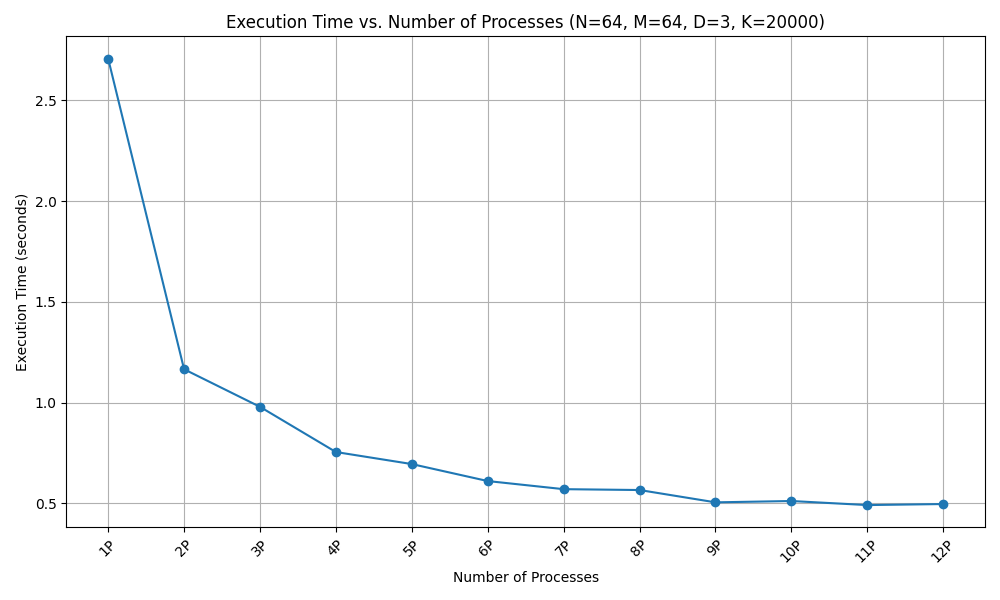
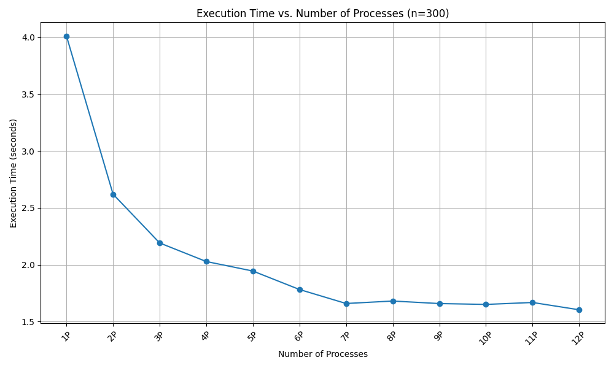
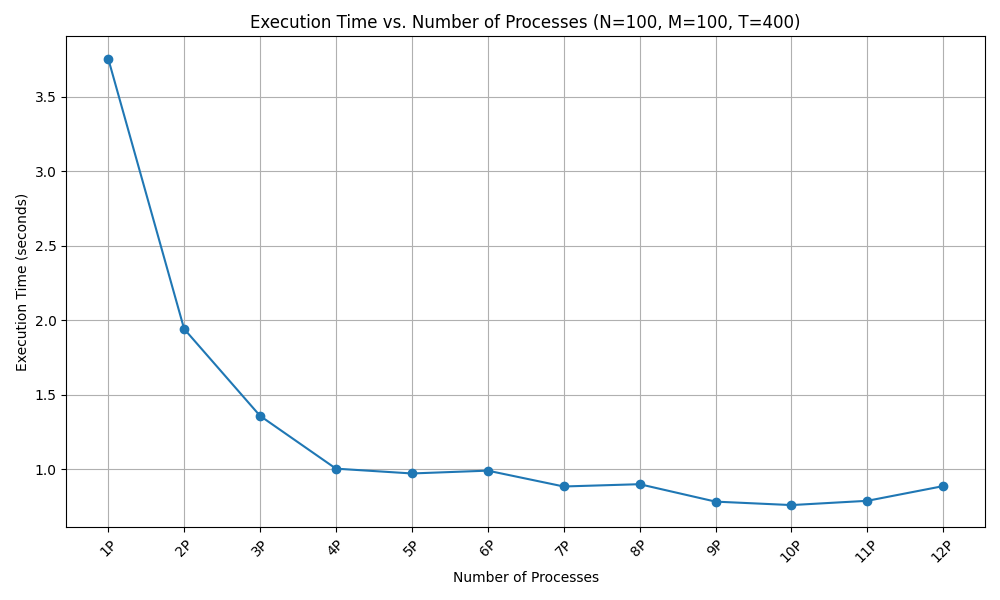

# Distributed Systems - Assignment 1

## Question 1 - A

### Time Complexity

#### Computation

Each process computes a portion of the Multibrot set. The computation involves iterating up to $K$ times for each of the $N \cdot R_p$ points where $R_p$ is the number of rows per process, resulting in a time complexity of $O(N \cdot R_P \cdot  K)$. Since $R_p$ is approximately $ M / P$, the computation time complexity per process is $O(\frac{N \cdot M \cdot K }{P})$. 

Here $N$ & $M$ are the number of points along x-axis and y-axis, and they are also the number of columns and number of rows respectively. $P$ is the number of processes.

#### Communication

Broadcasting $N, M, D, K$: This is a constant-time operation, $O(1)$, since only a small fixed amount of data is broadcast.
Gathering results: The gather operation involves collecting data from all processes. The time complexity of this operation can vary based on the implementation but is generally proportional to the number of processes and the size of the data being collected.

In total, the time complexity is dominated by the computation part, which is $O(\frac{N \cdot M \cdot K }{P})$.

### Message Complexity

#### Broadcast

There are four broadcasts, each sending a small, fixed amount of data $(N, M, D, K)$. The message complexity for broadcasting is $O(1)$.

Gather: The gather operation (Gatherv) involves communication from all processes to the root. The message complexity for gathering is $O(P)$, where size is the number of processes.

### Space Requirements

#### Each Process

Each process stores a portion of the Multibrot set, specifically, $R_{max} \cdot N$ integers where $R_{max}$ is the maximum number of rows a process can have. Since $R_{max}$ is roughly $M / P$, the space requirement per process is $O(N * M / P)$.

#### Root Process

 The root process additionally needs to store the complete result, which is an array of $N \cdot M$ integers. Thus, the space requirement at the root process is $O(N * M)$.

Additional MPI Buffers: MPI requires additional buffers for send_data, recv_data, send_counts, and displacements. The size of these buffers is proportional to the size of the data being sent and received.

### Peformance Scaling

## Question 2

### Time complexity

The Floyd-Warshall algorithm has a time complexity of $O(N^3)$ in a serial implementation, where $N$ is the number of vertices. In the parallel version, the computation is divided among the processes. Assuming $P$ processes and an ideal scenario where the workload is evenly distributed and there's no communication overhead, the time complexity per process would be approximately $O(\frac{N^3}{P})$. However, the communication overhead due to broadcasting rows and gathering the final matrix impacts the total time complexity, making it higher than the ideal case.

### Message Complexity

The message complexity depends on the number of messages sent between processes. In this implementation:

Each iteration of the main loop broadcasts a row of the matrix to all processes, resulting in $O(N)$ broadcasts.
At the end of the algorithm, the gathered data is sent to the root process. This is $O(P)$, where $P$ is the number of processes.

Thus, the total message complexity is $O(N+P)$.

### Space Requirements

Each process stores a portion of the matrix and some additional information. The memory requirement per process is roughly $O(\frac{N^2}{P})$ for storing the portion of the matrix, plus a small overhead for variables like $row_k$.

### Performance Scaling

## Question 3

### Time Complexity

The time complexity of the Game of Life depends on the number of generations simulated ($T$), the size of the grid ($N$ rows and $M$ columns), and the work done in each generation.

1. **Grid Update per Generation**: To update the grid for each generation, each cell's state is computed based on its eight neighbors. This operation has a time complexity of $O(1)$ per cell. So, for the entire grid, it's $O(N \times M)$.

2. **Generations**: We do this for $T$ generations, so the complexity becomes $O(T \times N \times M)$.

3. **MPI Parallelization**: Assuming the work is evenly distributed across P processes, each process handles approximately \frac{N}{P} \times M cells. Therefore, the time complexity per process is $O\left(\frac{T \times N \times M}{P}\right)$.

So, the **Total Time Complexity** is $O\left(\frac{T \times N \times M}{P}\right)$.

### Message Complexity

The message complexity depends on the number of messages sent and received by each process. In this implementation:

1. **Initial Distribution**: The root process sends a portion of the grid to each of the other processes. This is $P-1$ messages.

2. **Final Gathering**: Each of the $P-1$ non-root processes sends their portion of the grid back to the root process, which is another $P-1$ messages.

3. **Edge Communication**: If processes needed to exchange edge rows for accurate computation (which the current implementation does not handle), this would add additional messages per generation.

So, the **Total Message Complexity** is approximately $2(P-1)$ messages.

### Space Requirements

The space requirement is determined by the size of the grid each process stores:

1. **Grid Storage per Process**: Each process stores approximately $\frac{N}{P} \times M$ cells.

2. **Auxiliary Space**: Additional space for the new state grid, which is also of the size $\frac{N}{P} \times M$.

Therefore, the **Space Requirement per Process** is approximately $2 \times \left(\frac{N}{P} \times M\right)$ cells.

### Performance Scaling

### Bugs/Limitations

It is a known error in the implementation of question 3 that the program errs when given a matrix of large dimensions is given as an input.

What I found was the following:

- The program works for an arbitrarily large inputs when run on 1 process

- The program works for an random matrix of small dimensions when run on any number of processes

- The program errs on an arbitrarily large inputs when run on more than 1 process.
  
  - This error is partial as not all rows are calculated incorrectly, only a few rows (usually those of the form $8n+1$ $\&$ $8n+2$ or the likes). This suggests that either 1) there is a problem with how the results are being gathered or 2) there is a certain process which is doing incorrect computation
  
  - This error possibly arises from the improper handling of boundary conditions.